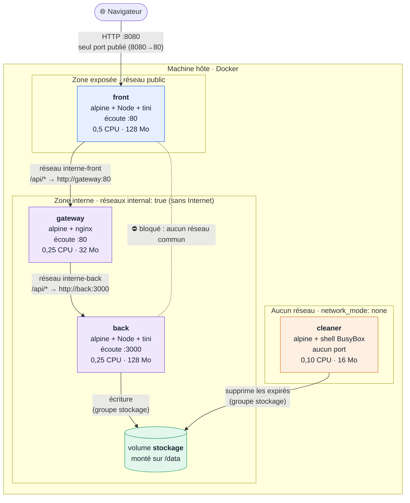
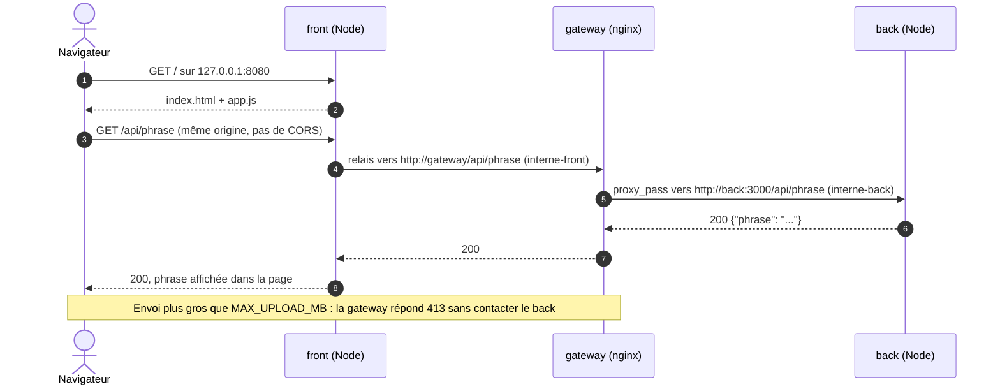
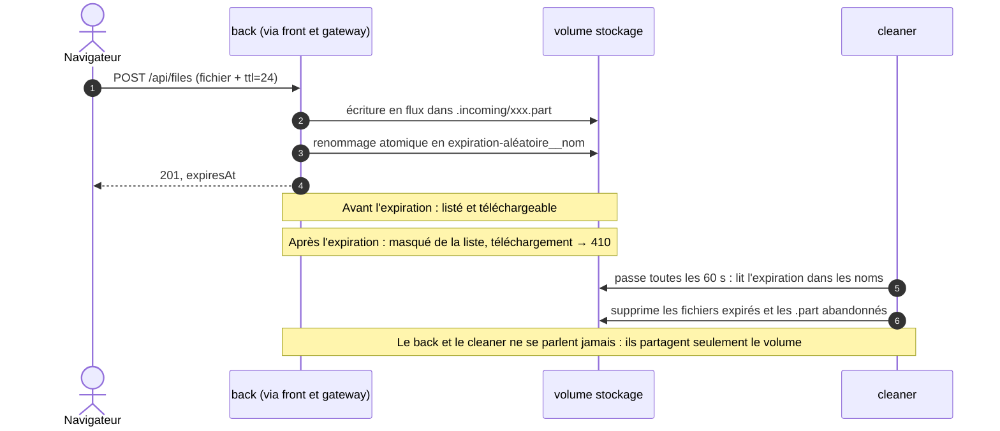
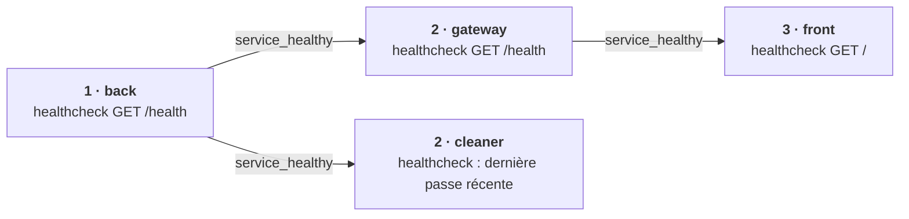

# M2 TP Docker - Docker Cloud

Mise en place d'une architecture virtualisée basée sur Docker : images personnalisées (front, back, serveur web) orchestrées avec Docker Compose.

Aucune image applicative n'est récupérée telle quelle depuis Docker Hub : chaque image part d'un OS minimal (`alpine`) et tout le reste est installé et configuré par nos soins.

## Sujet : cloud de fichiers éphémères

Un service de partage de **fichiers temporaires**, sur le modèle de WeTransfer, hébergé sur notre propre « cloud » Docker. Chaque fichier envoyé a une **durée de vie** (1 h, 24 h, 7 jours...) : passé ce délai, il n'est plus téléchargeable, puis il est supprimé automatiquement par un service dédié.

Le sujet de départ, un cloud de stockage générique, a été **affiné après un retour du prof** : une spécificité (les fichiers temporaires) donne davantage de choix Docker à concevoir et à justifier.

| Fonctionnalité | Description |
|---|---|
| Envoyer un fichier | Avec une durée de vie choisie (défaut 24 h, maximum 7 jours) |
| Lister les fichiers | Nom, taille, date d'envoi, **date d'expiration** ; les fichiers expirés n'apparaissent plus |
| Télécharger un fichier | Sous son nom d'origine ; `410 Gone` si le fichier a expiré |
| Supprimer un fichier | Avant son expiration, à la demande |
| Nettoyage automatique | Un worker supprime les fichiers expirés et les envois abandonnés |

### Ce que le sujet permet de montrer avec Docker

| Notion Docker | Mise en œuvre dans le projet |
|---|---|
| Images personnalisées | Images construites depuis `alpine` : front (Node), back (Node, multi-stage), gateway (nginx), puis le worker de nettoyage (shell BusyBox). |
| Persistance | Les fichiers sont stockés dans un **volume Docker** : ils survivent à l'arrêt, à la suppression et à la reconstruction des conteneurs. |
| Volume partagé | Le back écrit et le worker supprime dans le même volume, grâce à un **groupe Unix commun** (`stockage`, même GID dans les deux images). |
| Isolation réseau | Seul le front est publié. La gateway et le back restent sur deux réseaux internes séparés : le front ne peut joindre le back qu'à travers la gateway. |
| Arguments au run | Durée de vie par défaut et maximale, quota de stockage, taille max d'envoi : réglables dans le `.env`, sans rebuild. |
| Limitation des ressources | CPU et mémoire par conteneur, dimensionnés par un benchmark, plus une taille max d'envoi et un quota de stockage. |
| Scalabilité | Plusieurs instances du back derrière la gateway nginx. L'expiration est inscrite dans le nom des fichiers, donc le back reste sans état (voir [Scalabilité](#scalabilité)). |

### Avancement

| Étape | Statut |
|---|---|
| 3 images (front, back, gateway), compose, réseaux, healthchecks, SIGTERM, benchmark | ✅ Fait |
| Volume `stockage` monté sur le back (droits, persistance testés) | ✅ Fait |
| API de fichiers en Express (envoi, liste, téléchargement, suppression), image multi-stage | ✅ Fait |
| Gateway : envois en flux, découverte des instances du back (`resolver`) | ✅ Fait |
| Durée de vie des fichiers, quota, envois atomiques | ✅ Fait |
| Worker de nettoyage (4e image) : aucun réseau, volume partagé, arrêt propre mesuré | ✅ Fait |
| Durcissement : systèmes de fichiers en lecture seule | ⏳ À faire |
| Interface web (Angular) | ⏳ À faire |
| Démonstration du scaling | ⏳ À faire |

## Architecture actuelle

Les schémas ci-dessous sont écrits en [Mermaid](https://mermaid.js.org/) : GitHub les affiche directement, et ils restent versionnés et modifiables comme du code. Une version image du schéma d'architecture est aussi disponible : [docs/architecture.png](docs/architecture.png).

### Schéma d'architecture : services, réseaux, ports, volume



| Élément | À retenir |
|---|---|
| Seul port publié | `8080` sur l'hôte → `80` du front. Aucun autre service n'a de `ports:`. |
| Réseaux | `public` (front), `interne-front` (front + gateway), `interne-back` (gateway + back), **aucun** pour le cleaner. La gateway est le seul pont : le lien direct front → back est bloqué. |
| Volume | `stockage`, monté sur `/data` du back (écriture) et du cleaner (suppression), avec un groupe Unix commun. |
| Ressources | Limites CPU / mémoire par service, issues du `.env` et dimensionnées par un benchmark. |

### Schéma des communications : chemin d'une requête



Le navigateur ne connaît que le front : il ne peut pas résoudre les noms de service Docker (`gateway`, `back`). C'est le `server.js` du front qui relaie `/api` vers la gateway, puis nginx qui transmet au back.

### Cycle de vie d'un fichier éphémère



### Ordre de démarrage



Chaque service attend que le précédent soit `healthy` (`depends_on: condition: service_healthy`) : la gateway ne reçoit du trafic qu'une fois le back prêt (sinon elle répondrait `502`), le front n'est ouvert qu'une fois toute la chaîne prête, et le cleaner attend que le back ait initialisé les droits du volume.

## Architecture cible

```
  Navigateur
      │ :8080
      ▼
  ┌─────────┐  http://gateway/api  ┌─────────┐   répartition    ┌─────────┐
  │  front  │ ───────────────────▶ │ gateway │ ───────────────▶ │ back #1 │──┐
  └─────────┘                      │  nginx  │ ──────┐          └─────────┘  │
                                   └─────────┘       │          ┌─────────┐  │   ┌────────────────┐
                                                     ├────────▶ │ back #2 │──┼──▶│ volume Docker  │
                                                     │          └─────────┘  │   │ "stockage"     │
                                                     │          ┌─────────┐  │   │ /data/fichiers │
                                                     └────────▶ │ back #3 │──┘   └────────────────┘
                                                                └─────────┘
```

## Scalabilité

L'objectif est de pouvoir lancer **plusieurs instances du back** avec une seule commande, sans changer de configuration. La gateway nginx répartit les requêtes entre elles.

### Principe

| Élément | Rôle dans la scalabilité |
|---|---|
| `docker compose up --scale back=3` (ou `deploy.replicas: 3`) | Lance 3 conteneurs identiques à partir de la même image `back`. |
| DNS interne Docker | Le nom de service `back` renvoie les adresses IP de **toutes** les instances. |
| nginx (`upstream`) | Répartit les requêtes `/api` entre les instances (round-robin par défaut). |
| Volume partagé | Toutes les instances lisent et écrivent dans le **même** volume `stockage` : un fichier envoyé via `back #1` est téléchargeable via `back #3`. |

### Conditions pour que ça fonctionne

1. **Back sans état (stateless)** : aucune donnée n'est gardée en mémoire dans le conteneur. Les fichiers et leurs informations (nom, taille, date) sont lus directement depuis le volume. N'importe quelle instance peut donc répondre à n'importe quelle requête.
2. **Pas de port publié sur le back** : plusieurs instances ne pourraient pas publier le même port sur la machine hôte. C'est déjà le cas, puisque seul le front est publié. C'est la gateway qui rend le scaling possible.
3. **Pas de `container_name`** sur le back : Docker doit pouvoir nommer lui-même chaque instance (`back-1`, `back-2`...).
4. **nginx doit voir les nouvelles instances** : ✅ en place. La gateway interroge le DNS de Docker (`resolver 127.0.0.11 valid=10s`) au lieu de résoudre `back` une seule fois au démarrage. Testé : avec `--scale back=3`, les 3 instances répondent sans redémarrer nginx.
5. **Noms de fichiers uniques** : deux instances qui écrivent en même temps ne doivent pas écraser le même fichier. On peut par exemple préfixer chaque nom par un identifiant unique.

### Ressources

Les limites de `deploy.resources` s'appliquent **à chaque instance**. Avec 3 instances du back à 0,25 CPU et 128 Mo, le back peut consommer au total 0,75 CPU et 384 Mo. Le benchmark montre aussi qu'il faudra augmenter la gateway et le front en proportion, sinon ils deviendront le goulot (voir [Benchmark](#benchmark--comment-les-limites-ont-été-choisies)). Le nombre d'instances se choisit en fonction des ressources de la machine.

### Démonstration prévue

Chaque réponse du back contiendra un en-tête `X-Served-By` avec le nom du conteneur qui a répondu. En rafraîchissant la page, on voit les requêtes passer d'une instance à l'autre, alors que tous les fichiers restent visibles.

### Pourquoi c'est un avantage de Docker par rapport aux VM

| | Machines virtuelles | Conteneurs Docker |
|---|---|---|
| Ajouter une instance | Créer et démarrer une VM complète (OS invité) : plusieurs minutes, plusieurs Go | Une commande (`--scale`) : quelques secondes, quelques Mo de mémoire par instance |
| Configuration | À reproduire sur chaque VM | Identique pour toutes les instances, car elles viennent de la même image |
| Ressources | Réservées par VM, même au repos | Partagées avec le noyau de l'hôte, limitées par conteneur (`cpus`, `memory`) |

## Structure du projet

```
.
├── Frontend/
│   ├── Dockerfile
│   ├── server.js        # serveur HTTP Node : sert la page et relaie /api vers la gateway
│   └── src/
│       ├── index.html   # page affichée
│       └── app.js       # JS client : récupère et affiche la phrase
├── Backend/
│   ├── Dockerfile
│   ├── package.json     # dépendances : express, multer
│   ├── package-lock.json
│   └── src/
│       └── server.js    # API Express : fichiers (liste, envoi, téléchargement, suppression)
├── Gateway/
│   ├── Dockerfile
│   ├── nginx.conf.template  # config nginx avec ${VARIABLES} remplacées au démarrage
│   └── entrypoint.sh        # génère la config puis lance nginx
├── Cleaner/
│   ├── Dockerfile           # worker de nettoyage : alpine sans paquet ajouté
│   └── cleanup.sh           # supprime les fichiers expirés et les envois abandonnés
├── Bench/
│   ├── Dockerfile           # outil de charge ab (profil compose "bench")
│   └── run-bench.ps1        # mesure CPU/mémoire de chaque service sous charge
├── docs/
│   └── architecture.png     # export image du schéma d'architecture (Mermaid)
├── docker-compose.yml       # orchestration des 3 conteneurs
├── .env                     # valeurs de configuration lues par le compose
├── .gitattributes           # force les .sh en fins de ligne LF
├── .gitignore               # node_modules, builds Angular, logs
├── AGENTS.md                # règles du projet pour les agents IA (CLAUDE.md l'importe)
├── questui-DESIGN.md        # design system de l'interface (thème RPG médiéval)
└── README.md
```

---

## Variables : ARG, ENV et .env

La configuration se fait à trois niveaux, chacun avec un rôle précis :

| Niveau | Où | Quand | Rôle |
|---|---|---|---|
| `ARG` | Dockerfile | **Build** uniquement | Paramètre la construction de l'image (version d'Alpine, port documenté). N'existe plus dans le conteneur, sauf s'il est recopié dans un `ENV`. |
| `ENV` | Dockerfile | **Run** | Valeurs **par défaut** de l'application, présentes dans l'image. L'image fonctionne seule, même sans compose. |
| `.env` | Racine du projet | Lecture par **compose** | Source unique des valeurs : compose remplace chaque `${VARIABLE}` du `docker-compose.yml` par sa valeur. |

```
 .env ──▶ docker-compose.yml ─┬─ build.args:   ──▶ ARG  (build de l'image)
                              ├─ environment:  ──▶ ENV  (surcharge au run, sans rebuild)
                              └─ deploy / ports ──▶ ressources CPU/mémoire, port publié
```

### ARG communs aux 3 images

| ARG | Défaut | Utilisation |
|---|---|---|
| `ALPINE_VERSION` | `3.20` | Déclaré **avant** `FROM` pour être utilisable dans `FROM alpine:${ALPINE_VERSION}`. On change la version de l'OS de toutes les images depuis le `.env`, sans toucher aux Dockerfile. |
| `PORT` | `80` (front, gateway) / `3000` (back) | Sert à `EXPOSE ${PORT}` et de valeur par défaut à `ENV PORT=${PORT}`. Le port documenté par l'image et le port d'écoute restent ainsi cohérents. |

### Pourquoi un `.env` ?
- **Une seule source de vérité** : les ports, la mémoire, les CPU et la phrase sont regroupés dans un seul fichier. Le `docker-compose.yml` ne contient plus de valeurs en dur.
- **Cohérence entre services** : `BACK_PORT` est utilisé à la fois par le back (port d'écoute) et par la gateway (port à joindre). Une seule modification met les deux à jour.
- **Surcharge simple** : une variable d'environnement du shell est prioritaire sur le `.env`. Par exemple, `BACK_PHRASE="Autre phrase" docker compose up -d` change la phrase sans modifier de fichier ni reconstruire l'image (testé).
- Le `.env` est **versionné volontairement** : il ne contient aucun secret, seulement de la configuration.

---

## Image Frontend

**Point d'entrée** de l'architecture. Le `server.js` a deux rôles :

| Requête reçue | Traitement |
|---|---|
| `/`, `/index.html`, `/app.js` | Fichiers de `src/` servis au navigateur |
| `/api/...` | Relayée vers `http://${GATEWAY_HOST}:${GATEWAY_PORT}` (la gateway), puis la réponse est renvoyée au navigateur |
| autre | `404` |

Le relais est nécessaire car le navigateur ne peut pas résoudre le nom de service Docker `gateway` : seul un conteneur du réseau interne le peut. Le navigateur appelle donc `/api/phrase` sur le front (même origine, pas de CORS), et c'est le front qui contacte la gateway. Si la gateway est injoignable, le front répond `502`.

Le relais transmet le corps des requêtes en flux, ce qui convient aux uploads. Si la gateway répond avant la fin de l'envoi (par exemple `413` pour un fichier trop gros), le front lit le reste du corps sans le transmettre : sans ça, le client restait bloqué à attendre de finir son envoi (bug trouvé et corrigé en testant la limite d'upload).

### Fichiers communs aux 3 images

| Fichier / instruction | Justification |
|---|---|
| `.dockerignore` | Le contexte de build ne contient que l'utile : build plus rapide, et pas de `node_modules` Windows, de `.git` ni de logs dans l'image (bonne pratique du cours). |
| `LABEL org.opencontainers.image.*` | Métadonnées au format standard OCI (titre, description, auteur, dépôt), lisibles avec `docker inspect` : l'image se décrit elle-même. |

### Image de base

| Choix | Justification |
|---|---|
| `alpine:3.20` | OS minimal (~8 Mo) : surface d'attaque réduite et image légère. On n'utilise pas l'image officielle `node` : Node est installé nous-mêmes. |
| Version fixée (`3.20`) plutôt que `latest` | Build reproductible : la même version d'OS et de Node à chaque build, pas de changement surprise. La version est passée par l'ARG `ALPINE_VERSION`. |
| Ordre des instructions | Ce qui change rarement en haut (OS, paquets, utilisateur, variables), le code (`COPY`) en bas. Modifier le code ne reconstruit que les dernières couches : les couches au-dessus restent en cache. |

Pas de **multi-stage build** : il n'y a aucune étape de compilation (pas de TypeScript, pas de bundler, pas de `npm install`). Un stage de build n'apporterait rien.

### Dépendances installées

Installées via `apk add --no-cache` (`--no-cache` : on ne conserve pas l'index des paquets dans l'image, ce qui l'allège).

| Dépendance | Rôle | Pourquoi ce choix |
|---|---|---|
| `nodejs` | Exécute `server.js`, qui distribue la page et relaie `/api` | Seul le runtime est installé, sans `npm` : le serveur et le relais utilisent uniquement le module natif `http`, donc aucune librairie externe n'est nécessaire. |
| `tini` | Init minimal lancé en PID 1 | Transmet correctement les signaux (SIGTERM lors d'un `docker stop`) à Node et nettoie les processus zombies. Sans lui, Node en PID 1 peut ignorer SIGTERM et le conteneur est tué brutalement après 10 s. |
| `tzdata` | Base des fuseaux horaires | Permet d'avoir l'heure de Paris (`TZ=Europe/Paris`) dans les logs au lieu de l'UTC. |

`wget`, utilisé par le healthcheck, est déjà fourni par BusyBox dans Alpine : rien à installer.

### Manipulations sur l'OS

| Instruction | Explication |
|---|---|
| `ENV TZ=Europe/Paris` | Fuseau horaire du conteneur (s'appuie sur `tzdata`). |
| `RUN adduser -D -H front` | Crée un utilisateur `front` sans mot de passe (`-D`) ni dossier personnel (`-H`). Le serveur tourne avec cet utilisateur et non en root : en cas de faille, l'attaquant n'a pas les droits root dans le conteneur. |
| `WORKDIR /app` | Dossier de travail de l'application. |
| `COPY server.js ./` et `COPY src/ ./src/` | Les fichiers appartiennent à root : l'utilisateur `front` peut les lire mais pas les modifier. `server.js` reste en dehors de `src/` pour ne jamais être servi au navigateur. |
| `USER front` | Bascule sur l'utilisateur non-root pour l'exécution. |

### Ports exposés

| Port | Usage |
|---|---|
| `80` | Port HTTP du serveur front (valeur par défaut de `PORT`). C'est le seul port publié sur la machine hôte dans le compose (`8080:80`). |

`EXPOSE` documente les ports : leur publication réelle se fait au run (`-p` ou `ports:` dans le compose).

### Arguments de build (ARG)

| ARG | Défaut | Rôle |
|---|---|---|
| `ALPINE_VERSION` | `3.20` | Version de l'OS de base. |
| `PORT` | `80` | Port documenté (`EXPOSE`) et valeur par défaut de `ENV PORT`. |

### Arguments attendus au run (ENV)

Variables d'environnement surchargeables avec `-e` ou `environment:` dans le compose :

| Variable | Défaut | Rôle |
|---|---|---|
| `PORT` | `80` (vient de l'ARG) | Port d'écoute du serveur HTTP. |
| `NODE_OPTIONS` | `--max-old-space-size=128` | Mémoire max du tas Node (Mo). Variable lue par Node lui-même : pas besoin de shell dans la `CMD`. À aligner sur la limite mémoire du conteneur pour que Node libère la mémoire avant d'être tué par Docker. Dans le compose, la valeur vient de `FRONT_NODE_MAX_MEMORY`. |
| `GATEWAY_HOST` | `gateway` | Hôte vers lequel relayer `/api` : le nom du service gateway dans le compose. |
| `GATEWAY_PORT` | `80` | Port de la gateway. |
| `TZ` | `Europe/Paris` | Fuseau horaire. |

### Healthcheck

```dockerfile
HEALTHCHECK --interval=10s --timeout=3s --retries=3 \
  CMD wget -qO- http://localhost:${PORT}/ || exit 1
```

Docker interroge la page toutes les 10 s. Le conteneur passe en `healthy` quand le serveur répond, ce qui permettra au compose d'ordonner le démarrage (`depends_on: condition: service_healthy`).

### Entrypoint et gestion de SIGTERM

```dockerfile
ENTRYPOINT ["/sbin/tini", "--"]
CMD ["node", "server.js"]
```

- **`ENTRYPOINT` = `tini`** : toujours exécuté en PID 1, il relaie les signaux à Node et nettoie les processus zombies. Node lancé seul en PID 1 ignore SIGTERM par défaut.
- **`CMD` en forme exec, sans shell** : Node est lancé directement par `tini` (vérifié avec `ps` : PID 1 = `tini`, son enfant direct = `node`). La limite mémoire passe par `NODE_OPTIONS`, que Node lit tout seul : plus besoin de `sh -c` pour remplacer une variable.
- **`CMD` séparée de l'`ENTRYPOINT`** : on peut la remplacer au run (`docker run front node -v`) tout en gardant `tini`.
- **Dans `server.js`** : à la réception de SIGTERM, le serveur arrête d'accepter les connexions, termine celles en cours puis quitte avec le code 0.

Résultat testé : un `docker stop` arrête le conteneur en moins d'une seconde, au lieu d'attendre le kill forcé à 10 s.

### Build et run

```bash
docker build -t front ./Frontend
docker run -d --name front -p 8080:80 -e NODE_OPTIONS=--max-old-space-size=64 -e GATEWAY_HOST=gateway --memory=128m --memory-swap=128m --cpus=0.5 front
```

Seul, le front sert la page, mais `/api/phrase` renvoie `502` tant qu'aucune gateway n'est joignable : voir la section Orchestration.

---

## Image Backend

API du cloud de fichiers éphémères, en **Express + multer**. Elle lit et écrit les fichiers directement dans `STORAGE_DIR` (le volume `stockage`), sans base de données : la **date d'expiration est inscrite dans le nom** de chaque fichier stocké. Le front l'appelle en passant par la gateway.

### Routes

| Route | Réponse |
|---|---|
| `GET /api/files` | `200` : liste `[{ name, originalName, size, date, expiresAt }]` des fichiers **non expirés**, du plus récent au plus ancien |
| `POST /api/files` | Envoi d'un fichier (multipart : champ `file`, champ `ttl` optionnel en heures) : `201` `{ name, originalName, size, expiresAt }` ; `400` sans fichier ou `ttl` invalide ; `413` au-delà de `MAX_UPLOAD_MB` ; `507` si le quota de stockage est atteint |
| `GET /api/files/:name` | `200` : téléchargement sous le nom d'origine ; `410 Gone` si le fichier a expiré ; `404` si absent |
| `DELETE /api/files/:name` | `204` ; `404` si absent |
| `GET /api/phrase` | `{"phrase": "..."}` : route de la version Hello World, gardée tant que le front l'utilise |
| `GET /health` | `OK` : utilisée par le healthcheck |
| Toute autre route | `404` avec `{"error": "Not found"}` |

Chaque réponse porte un en-tête **`X-Served-By`** avec le nom du conteneur qui a répondu : il servira à montrer la répartition de charge quand le back sera lancé en plusieurs instances.

### Choix de l'API

| Choix | Justification |
|---|---|
| Express + multer | Express route les requêtes en quelques lignes ; multer gère le format multipart des envois, pénible à décoder à la main. Ce sont les deux seules dépendances. |
| Stockage sur disque (`multer.diskStorage`) | Le fichier est écrit **en flux** dans le volume : un fichier de 50 Mo ne passe jamais entièrement en mémoire. Cela compte avec une limite de 128 Mo par conteneur. |
| Nom stocké = `<expiration en secondes epoch>-<aléatoire>__<nom d'origine>` | **L'expiration est dans le nom** : pas de base de données ni de fichier annexe. Le back reste sans état (n'importe quelle instance sait si un fichier a expiré), et le worker de nettoyage la lit sans jamais parler à l'API. La partie aléatoire évite les écrasements entre deux envois du même nom ou entre instances. |
| Envoi dans `.incoming/`, puis **renommage atomique** | Le champ `ttl` peut arriver après le fichier dans le formulaire : l'expiration n'est connue qu'à la fin de l'envoi. Le fichier est donc écrit sous un nom temporaire `.part` dans `.incoming/`, puis renommé avec sa date d'expiration. Le renommage est atomique car `.incoming/` est **dans le même volume** : un fichier partiel n'apparaît jamais dans la liste. Un envoi refusé (`400`, `507`) est supprimé, un envoi interrompu reste dans `.incoming/` jusqu'au passage du worker (testé). |
| Pas de `tmpfs` pour les envois en cours | Un `tmpfs` est de la RAM **comptée dans la limite mémoire** du conteneur : 50 Mo par envoi simultané feraient dépasser les 128 Mo du back. Et un déplacement `tmpfs` → volume imposerait une copie complète, puisque ce sont deux systèmes de fichiers différents. |
| Fichier expiré : masqué et `410 Gone` | Le worker ne passe que toutes les N secondes : entre l'expiration et sa suppression, l'API ne doit déjà plus le lister ni le servir. `410` (« n'existe plus ») est plus juste que `404` (« n'a jamais existé »). |
| `ttl` entre 1 minute et `TTL_MAX_H` | En dessous d'une minute, le fichier expirerait avant d'avoir pu être partagé ; au-delà du maximum, ce n'est plus du stockage temporaire. |
| Quota `STORAGE_QUOTA_MB` (`507 Insufficient Storage`) | Protège le disque de l'hôte : même avec des durées de vie, des envois peuvent s'accumuler avant d'expirer. |
| Nom d'origine nettoyé | Seuls lettres (accents compris), chiffres, espaces et `. _ -` sont gardés : pas de chemin ni de caractère spécial dans le volume. |
| Contrôle du `:name` demandé | `path.basename` doit être identique au nom, et les noms cachés (`.xxx`) sont refusés : `../` ou `%2F` ne permettent pas de sortir du dossier de stockage (testé : `404`). |
| `MAX_UPLOAD_MB` aussi dans le back | Même limite que la gateway : une double sécurité si le back est appelé sans elle. Un envoi refusé ne laisse aucun fichier partiel (testé). |
| Erreurs : `413` pour un fichier trop gros, sinon `500` générique | Le détail technique reste dans les logs et n'est pas exposé au client. |

### Image de base : build multi-stage

Même base que le Frontend (`alpine:3.20`, version fixée, Node installé par nos soins), mais en **deux stages** :

```
Stage "deps"  : alpine + nodejs + npm ──▶ npm ci --omit=dev ──▶ node_modules
                                                                     │ COPY --from=deps
Stage final   : alpine + nodejs + tini + tzdata ◀───────────────────┘   (npm n'y entre jamais)
```

| Choix | Justification |
|---|---|
| Multi-stage | npm ne sert qu'à **installer** les dépendances, pas à faire tourner l'API. Le stage `deps` est jeté à la fin : npm, son cache et ses outils n'arrivent pas dans l'image livrée. L'image est plus petite et un attaquant dispose de moins d'outils (vérifié : `npm absent` dans l'image finale). |
| `COPY package.json package-lock.json` **avant** le code | La couche `npm ci` reste en cache tant que les dépendances ne changent pas. Vérifié : après une modification de `server.js`, le rebuild affiche `npm ci ... CACHED`, donc rien n'est réinstallé. |
| `npm ci` plutôt que `npm install` | Installe **exactement** les versions du `package-lock.json` : le build est reproductible. C'est la règle du cours. |
| `--omit=dev` | Aucune dépendance de développement en production. |

**Tailles mesurées :**

| Image | Taille | Commentaire |
|---|---|---|
| Version Hello World (`main`, Node natif, aucune dépendance) | 91,8 Mo | Référence : l'essentiel du poids vient de `nodejs` |
| Stage `deps` (avec npm) | 116 Mo | Ce que serait l'image sans multi-stage |
| **Image finale multi-stage** | **97,9 Mo** | 18 Mo de moins que sans multi-stage ; Express + multer n'ajoutent qu'environ 6 Mo |

### Dépendances installées

| Où | Dépendance | Rôle | Pourquoi ce choix |
|---|---|---|---|
| Stage `deps` (`apk`) | `nodejs`, `npm` | Installer les paquets npm | npm reste dans ce stage jetable. |
| Image finale (`apk`) | `nodejs` | Exécute `src/server.js` | Runtime seul, sans npm : les dépendances arrivent déjà installées. |
| Image finale (`apk`) | `tini` | Init minimal en PID 1 | Relaie SIGTERM à Node et nettoie les processus zombies, pour un arrêt propre. |
| Image finale (`apk`) | `tzdata` | Fuseaux horaires | Heure de Paris dans les logs de l'API. |
| npm (`package.json`) | `express` | Routage HTTP | Routes de l'API en quelques lignes. |
| npm (`package.json`) | `multer` | Décodage des envois multipart | Écrit les fichiers en flux sur le disque, sans les garder en mémoire. |

`apk add --no-cache` dans les deux stages : l'index des paquets n'est pas conservé. `wget` (healthcheck) est fourni par BusyBox : rien à installer.

### Manipulations sur l'OS

| Instruction | Explication |
|---|---|
| `ENV TZ=Europe/Paris` | Fuseau horaire du conteneur. |
| `RUN addgroup -g ${STORAGE_GID} stockage && adduser -D -H -G stockage back` | Crée le groupe `stockage`, avec un **GID fixe** venant d'un ARG, et l'utilisateur `back` (sans mot de passe ni dossier personnel) dont c'est le groupe principal : tout ce qu'il crée appartient au groupe. L'API ne tourne pas en root. Le GID est fixé parce que le worker de nettoyage doit appartenir au **même** groupe : pour le noyau, seul le numéro compte, pas le nom. |
| `RUN mkdir -p /data/files/.incoming && chown -R back:stockage /data && chmod -R 2775 /data` | Crée le dossier de stockage (et `.incoming/` pour les envois en cours) **avant** l'instruction `VOLUME` : quand Docker crée un volume neuf, il y recopie le contenu et les droits de ce dossier de l'image. `2775` : le groupe peut écrire dans le dossier, ce qui permettra au worker de supprimer (supprimer un fichier = écrire dans le **dossier**, pas dans le fichier). Le bit **setgid** (`2`) fait hériter du groupe `stockage` tout ce qui est créé dedans. Vérifié : `drwxrwsr-x back stockage`, et un fichier envoyé appartient bien à `back:stockage`. |
| `VOLUME /data` | Déclare `/data` comme dossier de données hors de la couche du conteneur. Même avec un simple `docker run`, sans compose, Docker crée un volume anonyme au lieu d'écrire dans le conteneur. Toute instruction placée après `VOLUME` qui modifierait `/data` serait ignorée : d'où le `chown` juste avant. |
| `WORKDIR /app` | Dossier de travail de l'application. |
| `COPY --from=deps /app/node_modules ./node_modules` | Récupère seulement les dépendances déjà installées par le stage `deps`, pas npm. |
| `COPY src/ ./src/` | Copie du code de l'API, qui appartient à root : `back` peut le lire mais pas le modifier. Copié en dernier, car c'est ce qui change le plus souvent. |
| `USER back` | Bascule sur l'utilisateur non-root pour l'exécution. |

### Ports exposés

| Port | Usage |
|---|---|
| `3000` | Port de l'API (valeur par défaut de `PORT`). Il n'est pas publié sur la machine hôte : seule la gateway y accède, via le réseau `interne-back`. |

### Arguments de build (ARG)

| ARG | Défaut | Rôle |
|---|---|---|
| `ALPINE_VERSION` | `3.20` | Version de l'OS de base. |
| `PORT` | `3000` | Port documenté (`EXPOSE`) et valeur par défaut de `ENV PORT`. |
| `STORAGE_GID` | `1500` | GID du groupe `stockage`, partagé avec le worker de nettoyage. Fourni par le `.env` aux deux images : une seule valeur, donc toujours identique. |

### Arguments attendus au run (ENV)

| Variable | Défaut | Rôle |
|---|---|---|
| `PORT` | `3000` (vient de l'ARG) | Port d'écoute de l'API. |
| `NODE_OPTIONS` | `--max-old-space-size=128` | Mémoire max du tas Node (Mo), lue par Node lui-même, à aligner sur la limite mémoire du conteneur. Dans le compose, la valeur vient de `BACK_NODE_MAX_MEMORY`. |
| `PHRASE` | `Hello World depuis le back !` | Phrase renvoyée par `/api/phrase`. Elle peut être changée au lancement sans rebuild de l'image. |
| `STORAGE_DIR` | `/data/files` | Dossier où l'API stockera les fichiers. Le code lit ce chemin au lieu de l'écrire en dur. Il doit rester sous `/data`, le point de montage du volume, sinon les fichiers seraient écrits dans le conteneur et perdus à sa suppression. |
| `MAX_UPLOAD_MB` | `10` (`50` dans le `.env`) | Taille max d'un envoi, la même que pour la gateway. Double sécurité : le back refuse aussi (`413`) si on l'appelle sans passer par la gateway. |
| `TTL_DEFAULT_H` | `24` | Durée de vie (heures) d'un fichier envoyé sans `ttl`. |
| `TTL_MAX_H` | `168` | Durée de vie maximale acceptée (7 jours) ; au-delà → `400`. |
| `STORAGE_QUOTA_MB` | `0` (`1024` dans le `.env`) | Taille totale maximale des fichiers stockés ; `0` = pas de quota. Au-delà → `507`. |
| `TZ` | `Europe/Paris` | Fuseau horaire. |

### Healthcheck

```dockerfile
HEALTHCHECK --interval=10s --timeout=3s --retries=3 \
  CMD wget -qO- http://localhost:${PORT}/health || exit 1
```

Contrairement au front, on interroge une route dédiée `/health` : elle vérifie que l'API répond sans dépendre de la logique métier. Le conteneur passe en `healthy`, ce qui permet à la gateway de démarrer seulement quand le back est prêt (`depends_on: condition: service_healthy`).

### Entrypoint et gestion de SIGTERM

```dockerfile
ENTRYPOINT ["/sbin/tini", "--"]
CMD ["node", "src/server.js"]
```

Même mécanisme que le Frontend : `tini` en PID 1 relaie les signaux à Node, lancé en forme exec sans shell. La mémoire est fixée par `NODE_OPTIONS`. Dans `server.js`, SIGTERM ferme le serveur proprement puis le processus quitte avec le code 0.

Résultat testé : `docker stop` arrête le conteneur en moins d'une seconde.

### Build et run

```bash
docker build -t back ./Backend
docker run -d --name back -p 3000:3000 -e PHRASE="Bonjour depuis le back" -e NODE_OPTIONS=--max-old-space-size=64 --memory=128m --memory-swap=128m --cpus=0.25 back
```

Le `-p 3000:3000` sert uniquement à tester l'API seule (`curl http://localhost:3000/api/phrase`). Dans le compose, le back n'est pas publié.

---

## Image Gateway (serveur web)

Passerelle d'API (API gateway) basée sur nginx, utilisé en reverse proxy : elle fait la **liaison entre le front et le back**. Elle n'est pas publiée sur la machine hôte : seul le front la contacte, par son nom de service `gateway`, sur le réseau `interne-front`.

**Pourquoi « gateway » et pas « proxy » ?** Techniquement, nginx reste un reverse proxy. Mais son rôle dans l'architecture est plus large : c'est le **seul chemin vers l'API**. Il bloque tout ce qui n'est pas `/api`, impose des limites (taille des uploads) et répartira la charge entre les instances du back. Le nom « gateway » décrit ce rôle, et il évite la confusion avec le relais `/api` du front, qui fait lui aussi office de proxy.

### Routage

| Requête reçue | Traitement | Rôle |
|---|---|---|
| `/api/...` | Redirigée vers `back:3000` | Appels à l'API (ex. `/api/phrase`) |
| `/health` | _Répond lui-même_ `OK` | Santé de la gateway (healthcheck) |
| tout le reste | `404` | La gateway ne sert qu'à joindre l'API : rien d'autre n'est accessible à travers elle. |

La gateway isole le back : le front ne connaît que l'adresse `gateway`, pas celle du back. On peut changer ou déplacer le back en modifiant seulement `BACK_HOST` et `BACK_PORT` de la gateway.

### Envois de fichiers et scaling

| Directive (`nginx.conf.template`) | Justification | Vérifié |
|---|---|---|
| `proxy_request_buffering off` | Par défaut, nginx **reçoit l'envoi en entier** dans un fichier temporaire avant de le transmettre au back : double écriture disque, attente avant que le back ne commence, et un `/tmp` assez grand pour 50 Mo par envoi simultané. Désactivé, l'envoi est transmis au back **au fil de l'eau** et écrit une seule fois, dans le volume. | Envoi de 40 Mo ralenti à 4 Mo/s, en regardant les fichiers ouverts par nginx (`/proc/*/fd`, car nginx supprime son fichier temporaire de l'arborescence tout en le gardant ouvert) : **1 fichier temporaire** avec la mise en tampon par défaut, **0** avec notre réglage. |
| `proxy_http_version 1.1` + `Connection ""` | Sans mise en tampon, nginx doit pouvoir transmettre un corps envoyé par morceaux (`chunked`), ce qui n'existe qu'en HTTP/1.1. Par défaut, nginx parle HTTP/1.0 au back. | Envois de 40 Mo → `201`. |
| `client_max_body_size ${MAX_UPLOAD_MB}m` | Inchangé : le refus (`413`) reste fait par nginx **avant** que le corps n'atteigne le back. | Envoi de 60 Mo (limite 50) → `413`. |
| `resolver 127.0.0.11 valid=10s ipv6=off` | Le DNS interne de Docker est interrogé toutes les 10 s au plus, au lieu d'une seule fois au démarrage : les instances du back ajoutées ou retirées par `docker compose up --scale back=N` sont prises en compte **sans redémarrer nginx**. `ipv6=off` : nos réseaux sont en IPv4, inutile d'attendre des réponses AAAA. | `--scale back=3` : les 3 instances répondent à tour de rôle (`X-Served-By` différent), et la gateway n'a pas été redémarrée. Retour à 1 instance → `200`. |
| `set $back_upstream ...` + `proxy_pass $back_upstream` | Une adresse écrite en dur dans `proxy_pass` est résolue une seule fois, au démarrage. Passer par une variable oblige nginx à utiliser le `resolver` à chaque requête. | Idem. |

**Conséquence sur le démarrage :** avant, nginx refusait de démarrer s'il ne trouvait pas `back`. Maintenant, il démarre et répond `502` à `/api/` tant que le back est absent (testé : `502` sans back, `200` dès son retour). Le `depends_on: service_healthy` de la gateway reste utile pour ne pas exposer ces `502` au démarrage de la stack.

### Image de base

`alpine:3.20`, comme les autres images. On n'utilise pas l'image officielle `nginx` : nginx est installé par nos soins depuis les paquets Alpine.

### Dépendances installées

Installées via `apk add --no-cache`.

| Dépendance | Rôle | Pourquoi ce choix |
|---|---|---|
| `nginx` | Serveur web / reverse proxy | Référence pour ce rôle : léger, performant, et une techno différente des images Node, adaptée au besoin « serveur web ». |
| `gettext-envsubst` | Commande `envsubst` | Remplace les `${VARIABLES}` du modèle de config par les valeurs passées au run. On installe uniquement ce sous-paquet, et non `gettext` complet, pour garder une image légère. |
| `tzdata` | Base des fuseaux horaires | Heure de Paris dans les logs d'accès nginx. |

Pas de `tini` ici : nginx est conçu pour tourner en PID 1. Son processus maître gère lui-même les signaux et ses processus workers.

### Manipulations sur l'OS

| Instruction | Explication |
|---|---|
| `ENV TZ=Europe/Paris` | Fuseau horaire du conteneur. |
| `COPY nginx.conf.template /etc/nginx/` | Modèle de configuration nginx, avec des variables à remplacer au démarrage. |
| `COPY --chmod=755 entrypoint.sh /` | Script de démarrage, rendu exécutable directement à la copie (pas de `RUN chmod` en plus). |
| `USER nginx` | L'utilisateur `nginx` est créé par le paquet nginx : pas besoin d'en créer un. nginx tourne donc sans les droits root. |
| Fichiers d'exécution dans `/tmp` (config générée, PID, fichiers temporaires) | Un utilisateur non-root ne peut pas écrire dans `/etc/nginx` ni `/var/lib/nginx` : tout ce que nginx écrit au run va dans `/tmp`. |
| Logs vers `/dev/stdout` et `/dev/stderr` | Les logs ne sont pas écrits dans des fichiers dans le conteneur : ils sont visibles avec `docker logs`. |

### Ports exposés

| Port | Usage |
|---|---|
| `80` | Port HTTP de la gateway, joint par le front sur le réseau `interne-front` (`GATEWAY_PORT`). Il n'est pas publié sur la machine hôte. |

### Arguments de build (ARG)

| ARG | Défaut | Rôle |
|---|---|---|
| `ALPINE_VERSION` | `3.20` | Version de l'OS de base. |
| `PORT` | `80` | Port documenté (`EXPOSE`) et valeur par défaut de `ENV PORT`. |

### Arguments attendus au run (ENV)

| Variable | Défaut | Rôle |
|---|---|---|
| `PORT` | `80` (vient de l'ARG) | Port d'écoute de nginx. |
| `WORKER_PROCESSES` | `1` | Nombre de processus workers nginx. À aligner sur le nombre de CPU alloués au conteneur (`cpus:` dans le compose). |
| `WORKER_CONNECTIONS` | `512` | Connexions simultanées max par worker. Plus la valeur est haute, plus nginx peut consommer de mémoire. |
| `BACK_HOST` / `BACK_PORT` | `back` / `3000` | Adresse du conteneur back (nom du service dans le compose). |
| `MAX_UPLOAD_MB` | `10` (`50` dans le `.env`) | Taille max d'un upload (`client_max_body_size`). Un fichier plus gros est refusé par la gateway (`413`) avant d'atteindre le back, ce qui protège sa mémoire et le stockage. Testé : 2 Mo envoyés avec une limite à 1 Mo → `413`. |
| `TZ` | `Europe/Paris` | Fuseau horaire. |

### Healthcheck

```dockerfile
HEALTHCHECK --interval=10s --timeout=3s --retries=3 \
  CMD wget -qO- http://127.0.0.1:${PORT}/health || exit 1
```

La route `/health` est traitée directement par nginx, sans passer par le back : elle vérifie uniquement que la gateway est en vie.

On utilise `127.0.0.1` et non `localhost` : dans Alpine, `localhost` se résout d'abord en IPv6 (`::1`), alors que nginx n'écoute qu'en IPv4. Le healthcheck échouait avec `localhost`.

### Entrypoint et gestion des signaux

```dockerfile
STOPSIGNAL SIGQUIT
ENTRYPOINT ["/entrypoint.sh"]
CMD ["nginx", "-e", "/dev/stderr", "-c", "/tmp/nginx.conf", "-g", "daemon off;"]
```

C'est le modèle **« wrapper d'init »** du cours : l'`ENTRYPOINT` prépare l'environnement, la `CMD` contient la commande à lancer. Le script `entrypoint.sh` fait deux choses :

1. **Génère la config** : `envsubst` remplace les variables du modèle et écrit `/tmp/nginx.conf`. La liste des variables est donnée explicitement à `envsubst` pour ne pas effacer les variables propres à nginx (`$host`, `$remote_addr`...).
2. **Lance la `CMD` avec `exec "$@"`** : la commande remplace le shell et devient PID 1, elle reçoit donc directement les signaux de Docker. `daemon off` garde nginx au premier plan, sinon le conteneur s'arrêterait aussitôt.

**Pourquoi séparer la commande du script ?** La `CMD` devient remplaçable au run tout en gardant la config générée. Par exemple, `docker compose run --rm gateway nginx -t -c /tmp/nginx.conf` vérifie la config générée (testé : « syntax is ok »), et `docker compose run --rm gateway sh` ouvre un shell pour déboguer.

**Pourquoi `STOPSIGNAL SIGQUIT` ?** Pour nginx, SIGTERM provoque un arrêt *rapide* qui coupe les connexions en cours, alors que SIGQUIT provoque un arrêt *gracieux* qui termine les requêtes en cours avant de quitter. Avec `STOPSIGNAL`, `docker stop` envoie SIGQUIT au lieu de SIGTERM. Si un SIGTERM est quand même reçu, nginx le gère aussi et s'arrête.

Résultat testé : `docker stop` arrête la gateway en moins d'une seconde.

### Build et run

La gateway a besoin du back sur le même réseau Docker. Elle démarre même s'il est absent (le nom `back` est résolu à chaque requête), mais répond alors `502` à `/api/`. Le front se branche ensuite sur ce réseau et joint la gateway par son nom.

```bash
docker build -t gateway ./Gateway
docker network create tp-net
docker run -d --name back  --network tp-net back
docker run -d --name gateway --network tp-net \
  -e WORKER_PROCESSES=1 -e WORKER_CONNECTIONS=512 --memory=32m --memory-swap=32m --cpus=0.25 gateway
docker run -d --name front --network tp-net -p 8080:80 front
```

Puis `http://localhost:8080/` affiche la page avec la phrase du back. Le compose remplace ces commandes et gère l'ordre de démarrage.

---

## Image Cleaner (worker de nettoyage)

Le cœur de la spécificité « fichiers éphémères » : un **worker** qui tourne en boucle et, à chaque passe :
- supprime les fichiers **expirés**, en lisant leur date d'expiration directement dans leur nom (`<epoch>-<aléatoire>__<nom>`), sans jamais parler à l'API ;
- supprime les **envois abandonnés** dans `.incoming/` (fichiers `.part` plus vieux que `INCOMING_MAX_AGE_MIN`).

Ce n'est pas un serveur : pas de port, pas de réseau, et un healthcheck qui ne passe pas par HTTP. C'est ce qui le distingue des trois autres images.

### Image de base

| Choix | Justification |
|---|---|
| `alpine:3.20`, **sans aucun paquet ajouté** | Le BusyBox d'Alpine fournit déjà tout ce dont le script a besoin : `sh`, `ls`, `awk`, `xargs`, `rm`, `find`, `stat`, `setsid`. Ajouter Node ou Python pour une boucle de quelques lignes alourdirait l'image et la surface d'attaque sans rien apporter. |
| Script shell plutôt qu'application | Le travail consiste à lister, filtrer et supprimer des fichiers : exactement ce que font les outils Unix de base. |

### Dépendances installées

**Aucune** (pas de `apk add`). Les outils utilisés sont ceux de BusyBox, déjà présents dans Alpine. Pas de `tzdata` non plus : les logs sont écrits en UTC, et le format l'indique explicitement (`...Z`) plutôt que d'afficher une heure locale trompeuse.

### Manipulations sur l'OS

| Instruction | Explication |
|---|---|
| `RUN addgroup -g ${STORAGE_GID} stockage && adduser -D -H -u 1002 -G stockage cleaner` | Utilisateur dédié `cleaner`, non-root, membre du groupe `stockage` **avec le même GID que le back** (ARG fourni par le `.env`). Supprimer un fichier demande le droit d'écriture sur le **dossier** : le dossier de stockage est en `2775` groupe `stockage`, le cleaner peut donc supprimer sans être root ni être `back`. |
| UID fixé à `1002` (et `1001` pour le back) | **Problème constaté en test** : par défaut, `adduser` donne l'UID 1000 au premier utilisateur de chaque image, donc `back` et `cleaner` avaient le même UID. Pour le noyau, seuls les numéros comptent : le cleaner était vu comme le **propriétaire** du dossier, avec tous les droits, et le groupe partagé ne servait à rien (il supprimait même dans un dossier en `755`). Avec des UID distincts, ce sont bien les droits du groupe qui s'appliquent. |
| `COPY --chmod=755 cleanup.sh /usr/local/bin/` | Script exécutable dès la copie (pas de `RUN chmod`, donc une couche de moins), copié en dernier car c'est ce qui change le plus. |
| Pas de `VOLUME /data` | Lancé seul, le worker n'a rien à nettoyer : c'est le compose qui lui partage le volume du back. Un `VOLUME` créerait ici un volume anonyme vide et trompeur. |
| `USER cleaner` | Exécution sans root. |

### Ports et réseau

Aucun port : le worker n'écoute rien et ne contacte personne. Dans le compose, **`network_mode: none`** lui retire toute interface réseau (vérifié : seule l'interface `lo` existe). C'est le moindre privilège poussé au bout : même compromis, il ne peut rien joindre.

### Arguments de build (ARG)

| ARG | Défaut | Rôle |
|---|---|---|
| `ALPINE_VERSION` | `3.20` | Version de l'OS de base. |
| `STORAGE_GID` | `1500` | GID du groupe `stockage`. Doit être identique à celui du back : une seule valeur dans le `.env`, passée aux deux images. |

### Arguments attendus au run (ENV)

| Variable | Défaut | Rôle |
|---|---|---|
| `STORAGE_DIR` | `/data/files` | Dossier à nettoyer (le volume partagé avec le back). |
| `CLEANUP_INTERVAL_S` | `60` | Délai entre deux passes. L'API masque déjà les fichiers expirés : l'intervalle ne retarde que la libération de l'espace disque, une minute suffit. |
| `INCOMING_MAX_AGE_MIN` | `60` | Âge à partir duquel un envoi `.part` est considéré comme abandonné. Même un envoi de 50 Mo à 100 Ko/s dure moins de 9 min. |
| `HEARTBEAT_FILE` | `/tmp/heartbeat` | Fichier de preuve de vie lu par le healthcheck. |

### Healthcheck

```dockerfile
HEALTHCHECK --interval=30s --timeout=3s --start-period=10s --retries=2 \
  CMD ["/usr/local/bin/cleanup.sh", "--healthcheck"]
```

Le worker n'a pas de réseau : impossible de l'interroger en HTTP. À la place, chaque passe met à jour `/tmp/heartbeat`, et le healthcheck vérifie que ce fichier a **moins de deux intervalles**. Si la boucle est bloquée (disque inaccessible, script figé), le conteneur passe `unhealthy`.

### Entrypoint et gestion de SIGTERM

```dockerfile
ENTRYPOINT ["/usr/local/bin/cleanup.sh"]
```

Le script est lancé directement en **PID 1**, sans `tini`. Il gère lui-même SIGTERM avec un `trap`, et ne laisse pas de processus enfant derrière lui.

Arrêter un worker qui supprime des fichiers est le cas typique où SIGTERM compte : il ne doit être ni tué au bout des 10 s (code `137`), ni laisser un état incohérent. La mise au point a demandé plusieurs essais, tous mesurés sur 10 000 fichiers expirés :

| Version | Problème mesuré | Correction |
|---|---|---|
| 1. Un `rm` par fichier | 10 000 processus : la passe n'était pas finie au bout de 45 s avec 0,1 CPU | Suppression **par lots** avec `xargs` (des centaines de noms par appel à `rm`) : 6 s. |
| 2. `xargs` lancé au premier plan | Le shell n'exécute un `trap` qu'à la fin de la commande en cours : avec peu de CPU, la passe dépassait 10 s → **code `137`** | Suppression lancée **en arrière-plan** + `wait`, qui est interrompu immédiatement par le signal. |
| 3. `kill` du processus de suppression | Ses enfants (`awk`, `xargs`, `rm`) continuaient | Suppression lancée avec **`setsid`**, dans son propre groupe de processus : le trap arrête tout le groupe d'un coup (`kill -TERM -<pgid>`). |
| 4. Signal reçu pendant le comptage initial | La suppression était quand même lancée → `137` avec 0,05 CPU | Le drapeau d'arrêt est vérifié **avant** de lancer la suppression. |
| 5. `kill $!` en fin de script | Sans attente lancée, `$!` n'existe pas et `set -u` faisait sortir avec le code `2` | PID du `sleep` mémorisé dans une variable, testée avant le `kill`. |

**Pourquoi on peut interrompre une suppression en cours :** chaque suppression (`unlink`) est **atomique**. Un fichier est soit supprimé, soit intact, jamais à moitié. Interrompre la passe laisse donc un état cohérent, et les fichiers restants sont traités au démarrage suivant (vérifié : 9 408 restants après l'arrêt, 0 après le redémarrage).

Autres choix du script :
- **`sleep` en arrière-plan + `wait`** entre deux passes : un `sleep` au premier plan bloquerait le `trap` jusqu'à la fin de l'attente (60 s).
- **`set -u`** : une variable mal orthographiée fait échouer le script au lieu de viser un mauvais dossier.
- **Contrôle après suppression** : les fichiers expirés encore présents sont comptés et journalisés en `ERREUR`. Un refus de droits ne passe pas inaperçu (testé : dossier passé en `755` → `ERREUR : 1 fichier(s) expiré(s) non supprimé(s)`).

**Résultats mesurés** (arrêt pendant une passe sur 10 000 fichiers, signal envoyé 1, 3 ou 5 s après le début) :

| CPU | Arrêt | Code de sortie |
|---|---|---|
| 0,05 | 0,6 à 2,3 s | `0` dans les 3 cas |
| 0,10 (retenu) | 0,5 à 0,6 s | `0` dans les 3 cas |

### Ressources (mesurées)

| Mesure (10 000 fichiers expirés) | 0,05 CPU | **0,10 CPU** | 0,25 CPU |
|---|---|---|---|
| Durée de la passe | 13 s | **6 s** | 2 s |
| Pic mémoire | ~8 Mo | ~4 Mo | ~5 Mo |

Au repos : **0 % de CPU et environ 0,5 Mo de mémoire**. Valeurs retenues : **0,10 CPU** (une passe de 10 000 fichiers reste bien plus courte que l'intervalle de 60 s), **16 Mo** de mémoire (2 fois le pic le plus élevé), réservation de 6 Mo (le minimum accepté par Docker). C'est de loin le service le plus léger de la stack.

### Build et run

```bash
docker build -t cleaner ./Cleaner
# avec le volume du back (créé par lui en premier, pour les droits)
docker run -d --name cleaner --network none -v docker-cloud_stockage:/data \
  --read-only --tmpfs /tmp:size=1m -e CLEANUP_INTERVAL_S=60 --memory=16m --memory-swap=16m --cpus=0.1 cleaner
docker logs -f cleaner   # une ligne par passe : fichiers supprimés, envois abandonnés, refus
```

---

## Orchestration (docker-compose.yml)

### Lancement

```bash
docker compose up -d --build   # build des 3 images puis démarrage
docker compose ps              # état et santé des conteneurs
docker compose down            # arrêt propre (SIGTERM / SIGQUIT) et suppression
```

L'application est accessible sur **http://localhost:8080**.

### Arguments traduits dans le compose

Toutes les valeurs viennent du fichier `.env` (voir [Variables : ARG, ENV et .env](#variables--arg-env-et-env)). Pour chaque service :
- `build.args` transmet les **ARG** du Dockerfile ;
- `environment:` surcharge les **ENV** du Dockerfile au run ;
- `deploy.resources` et `ports` utilisent aussi des variables du `.env`.

| Service | `build.args` (ARG) | `environment:` (ENV) | Variables du `.env` utilisées |
|---|---|---|---|
| `back` | `ALPINE_VERSION`, `PORT`, `STORAGE_GID` | `PORT`, `NODE_OPTIONS`, `PHRASE`, `STORAGE_DIR`, `MAX_UPLOAD_MB`, `TTL_DEFAULT_H`, `TTL_MAX_H`, `STORAGE_QUOTA_MB`, `TZ` | `BACK_PORT`, `BACK_NODE_MAX_MEMORY`, `BACK_PHRASE`, `STORAGE_DIR`, `STORAGE_GID`, `MAX_UPLOAD_MB`, `TTL_DEFAULT_H`, `TTL_MAX_H`, `STORAGE_QUOTA_MB`, `BACK_CPUS`, `BACK_MEMORY`, `BACK_MEMORY_RESERVATION` |
| `gateway` | `ALPINE_VERSION`, `PORT` | `PORT`, `WORKER_PROCESSES`, `WORKER_CONNECTIONS`, `BACK_HOST`, `BACK_PORT`, `MAX_UPLOAD_MB`, `TZ` | `GATEWAY_PORT`, `GATEWAY_WORKER_PROCESSES`, `GATEWAY_WORKER_CONNECTIONS`, `GATEWAY_CPUS`, `GATEWAY_MEMORY`, `GATEWAY_MEMORY_RESERVATION`, `BACK_PORT`, `MAX_UPLOAD_MB` |
| `front` | `ALPINE_VERSION`, `PORT` | `PORT`, `NODE_OPTIONS`, `GATEWAY_HOST`, `GATEWAY_PORT`, `TZ` | `FRONT_PORT`, `FRONT_PUBLISHED_PORT`, `FRONT_NODE_MAX_MEMORY`, `FRONT_CPUS`, `FRONT_MEMORY`, `FRONT_MEMORY_RESERVATION`, `GATEWAY_PORT` |
| `cleaner` | `ALPINE_VERSION`, `STORAGE_GID` | `STORAGE_DIR`, `CLEANUP_INTERVAL_S`, `INCOMING_MAX_AGE_MIN` | `STORAGE_DIR`, `STORAGE_GID`, `CLEANUP_INTERVAL_S`, `INCOMING_MAX_AGE_MIN`, `CLEANER_CPUS`, `CLEANER_MEMORY`, `CLEANER_MEMORY_RESERVATION` |

`ALPINE_VERSION` et `TZ` sont communs à tous les services.

Les noms d'hôte `gateway` et `back` sont les noms des services : le DNS interne de Docker les résout automatiquement vers les bons conteneurs. Ils sont écrits directement dans le compose, et non dans le `.env`, car ils dépendent de la structure du compose et non de la configuration. Aucune adresse IP n'est écrite en dur.

### Limitation des ressources

Définie pour chaque service dans le compose, avec des valeurs venant du `.env` :

| Réglage | Rôle |
|---|---|
| `deploy.resources.limits.cpus` | Plafond de CPU (`0.5` = la moitié d'un cœur). Au-delà, le conteneur est ralenti, pas tué. |
| `deploy.resources.limits.memory` | Plafond de mémoire. S'il est dépassé, le noyau tue le processus (OOM killer, code `137`), puis `restart: unless-stopped` le relance. |
| `memswap_limit` (égal à la limite mémoire) | **Désactive la swap.** Par défaut, Docker ajoute autant de swap que de RAM (mesuré : `MemorySwap` = 2 × la limite) : un conteneur « limité à 128 Mo » pouvait en réalité occuper 256 Mo, en ralentissant au lieu de s'arrêter. |
| `deploy.resources.reservations.memory` | Mémoire **garantie** (réservation souple) : si l'hôte manque de mémoire, Docker reprend d'abord la mémoire des conteneurs qui dépassent leur réservation. |

Valeurs retenues, justifiées par le benchmark ci-dessous :

| Service | CPU | Mémoire max | Tas Node | Réservation | Pic mesuré |
|---|---|---|---|---|---|
| `front` | **0,5** | 128 Mo | 64 Mo | 32 Mo | ~50 % CPU · ~25 Mo |
| `gateway` (nginx) | **0,25** | **32 Mo** | – | 8 Mo | ~26 % CPU · ~4 Mo |
| `back` | **0,25** | 128 Mo | 64 Mo | 32 Mo | ~25 % CPU · ~20 Mo |
| `cleaner` (worker) | **0,10** | **16 Mo** | – | 6 Mo | ~10 % CPU · ~4 Mo pendant une passe sur 10 000 fichiers ; 0 % · 0,5 Mo au repos |
| `bench` (outil) | 1 | 32 Mo | – | – | – |

### Benchmark : comment les limites ont été choisies

Les limites ne sont pas fixées au hasard : elles sont dimensionnées à partir de **mesures sous charge**, faites avec un outil construit pour l'occasion.

#### Outil de mesure

| Élément | Choix |
|---|---|
| Image `Bench/` | Alpine + `apache2-utils` (`ab`, outil de charge HTTP). Image faite par nous, comme les autres (pas d'image de bench du Hub), non-root, `ENTRYPOINT ["ab"]` : le conteneur s'utilise comme une commande. |
| Service `bench` dans le compose | Dans le profil `bench` : il ne démarre pas avec `docker compose up`, seulement à la demande. Branché sur le réseau `public` uniquement : il attaque le **front comme un vrai client**, donc la mesure couvre toute la chaîne front → gateway → back. Limité lui aussi (1 CPU) pour ne pas voler le CPU des services mesurés. |
| Script [Bench/run-bench.ps1](Bench/run-bench.ps1) | Lance chaque scénario `ab` et relève `docker stats` en parallèle pendant toute la charge, pour garder le **pic** CPU et mémoire de chaque service. |

```bash
docker compose up -d --build --wait
powershell -ExecutionPolicy Bypass -File Bench/run-bench.ps1                          # mesure complète (Windows)
docker compose --profile bench run --rm bench -n 5000 -c 50 http://front/api/phrase   # un scénario seul
docker stats                                                                          # suivi en direct, dans un autre terminal
```

Scénarios : au repos, 1 000 requêtes à 10 en parallèle, 5 000 requêtes à 50 en parallèle, 5 000 requêtes à 100 en parallèle. Machine de test : Docker Desktop, 12 CPU.

#### Étape 1 : mesure de départ (0,5 CPU pour chaque service)

| Scénario | front CPU / Mo | gateway CPU / Mo | back CPU / Mo | Req/s | p95 |
|---|---|---|---|---|---|
| Repos | 1 % / 12 Mo | 4 % / 2 Mo | 3 % / 11 Mo | – | – |
| 5 000 req, 50 en parallèle | **50 %** / 23 Mo | 31 % / 2 Mo | 33 % / 19 Mo | 763 | 103 ms |
| 5 000 req, 100 en parallèle | **50 %** / 25 Mo | 31 % / 2 Mo | 30 % / 18 Mo | 875 | 174 ms |

Constat : le **front plafonne à sa limite** (50 %) et bride toute la chaîne, alors que la gateway et le back ont de la marge. Avec la même part de CPU pour tous, une partie du CPU de la gateway et du back est gaspillée.

#### Étape 2 : coût de chaque service, en variant les CPU (5 000 req, 50 en parallèle)

| Config (front / gateway / back) | Req/s | p95 | Goulot observé |
|---|---|---|---|
| 0,25 / 0,5 / 0,5 | 294 | 306 ms | front, plafonné à 25 % |
| 0,5 / 0,5 / 0,5 | 763 | 103 ms | front, plafonné à 50 % |
| 1 / 0,5 / 0,5 | 1 225 | 80 ms | gateway, au maximum (52 %) |
| 1 / 0,25 / 0,5 | 781 | 97 ms | gateway, plafonnée à 25 % |
| 1 / 0,25 / 0,25 | 553 | 196 ms | gateway et back |
| 1 / 0,1 / 0,5 | 348 | 201 ms | gateway, plafonnée à 10 % |

Dans la config la plus rapide (1 225 req/s), on déduit le **coût CPU d'une requête** pour chaque service (CPU au pic ÷ débit) :

| Service | Coût CPU par requête | Pourquoi |
|---|---|---|
| front | ~0,74 ms | Le plus coûteux : il reçoit chaque requête **et** en ouvre une nouvelle vers la gateway (relais). |
| gateway (nginx) | ~0,42 ms | nginx est efficace, mais il relaie lui aussi chaque requête vers le back. |
| back | ~0,36 ms | Il ne fait que répondre. |

#### Étape 3 : dimensionnement retenu

**CPU, dosé en proportion du coût par requête**, pour que les trois services saturent à peu près au même débit et qu'aucun CPU ne soit gaspillé :
- front **0,5** : 0,5 / 0,74 ms ≈ 675 req/s ;
- gateway **0,25** : 0,25 / 0,42 ms ≈ 600 req/s ;
- back **0,25** : 0,25 / 0,36 ms ≈ 690 req/s.

Le front reçoit le double des autres parce qu'il coûte deux fois plus par requête. **nginx reçoit autant que le back, mais pas plus** : malgré sa légèreté, il traite toutes les requêtes. Lui donner moins (0,1 CPU) divise le débit de la stack par 3,5 (348 req/s).

**Mémoire, dosée selon le pic mesuré.** C'est là que nginx se distingue nettement :
- **gateway : 32 Mo** pour un pic d'environ 4 Mo. nginx ne garde presque rien en mémoire, et il écrit les gros corps de requête (uploads) sur disque, pas en RAM. 32 Mo laissent 8 fois de marge, soit 4 fois moins que les services Node.
- **front et back : 128 Mo** pour un pic d'environ 20 à 25 Mo. Node a un coût fixe plus élevé (moteur V8, environ 9 Mo au repos). La marge (plus de 5 fois) est prévue pour les uploads de l'application. Le tas JavaScript est plafonné à **64 Mo** (`NODE_OPTIONS`), la moitié de la limite : le reste couvre la mémoire hors tas (buffers des flux d'upload), pour que Node libère sa mémoire avant d'atteindre la limite du conteneur.
- **Réservations** légèrement au-dessus du pic mesuré (32 Mo pour Node, 8 Mo pour nginx) : même si l'hôte manque de mémoire, chaque service garde de quoi tourner normalement.

#### Étape 4 : validation avec les valeurs retenues (sans swap)

| Scénario | front CPU / Mo | gateway CPU / Mo | back CPU / Mo | Req/s | p95 | Échecs |
|---|---|---|---|---|---|---|
| Repos | 0 % / 9 Mo | 0 % / 2 Mo | 0 % / 8 Mo | – | – | – |
| 1 000 req, 10 en parallèle | 42 % / 13 Mo | 13 % / 2 Mo | 26 % / 12 Mo | 335 | 88 ms | 0 |
| 5 000 req, 50 en parallèle | 45 % / 22 Mo | 25 % / 3 Mo | 25 % / 19 Mo | 634 | 182 ms | 0 |
| 5 000 req, 100 en parallèle | 50 % / 25 Mo | 27 % / 4 Mo | 22 % / 20 Mo | 803 | 200 ms | 0 |

Avec **1 CPU au total** (contre 1,5 au départ), la stack garde 80 à 90 % du débit initial, sans aucun échec. Les trois services arrivent ensemble près de leur limite, ce qui montre que le dosage est équilibré. Les pics mémoire restent loin des plafonds.

#### Étape 5 : test de dépassement mémoire (OOM)

| Test | Résultat |
|---|---|
| Back limité à **6 Mo, sans swap** | Tué par le noyau (`OOMKilled=true`, code `137`), puis relancé en boucle par `restart: unless-stopped` (8 redémarrages en 20 s). C'est le comportement attendu d'une limite dépassée. |
| Back limité à 6 Mo **avec** la swap par défaut | Ne meurt pas : il déborde sur la swap (`MemorySwap` = 12 Mo). C'est ce constat qui a conduit à ajouter `memswap_limit`. |
| Processus qui alloue de la mémoire en boucle dans un conteneur à 48 Mo (swap par défaut) | Tué vers 80 Mo et non 48 : la limite réelle était doublée par la swap. |

#### Bug révélé par le benchmark

Le premier lancement d'`ab` restait **bloqué** après environ 500 requêtes. Le relais du front recopiait tels quels les en-têtes de nginx `transfer-encoding: chunked` et `connection: keep-alive`. Ce sont des en-têtes « hop-by-hop » (RFC 7230), propres à une connexion, qu'un proxy ne doit pas retransmettre. Un client HTTP/1.0 comme `ab` ne sait pas lire le format `chunked` et attendait une fermeture qui n'arrivait jamais ; les navigateurs, en HTTP/1.1, ne voyaient pas le problème. Le relais retire maintenant ces en-têtes (`withoutHopByHop` dans [Frontend/server.js](Frontend/server.js)). Résultat : 0 échec sur tous les scénarios.

### Ordre de démarrage

```yaml
gateway:
  depends_on:
    back:
      condition: service_healthy

front:
  depends_on:
    gateway:
      condition: service_healthy

cleaner:
  depends_on:
    back:
      condition: service_healthy
```

- La **gateway** attend que le back soit `healthy`. Depuis l'ajout du `resolver`, nginx démarrerait sans le back, mais il répondrait `502` à chaque appel d'API (testé) : on ne l'ouvre qu'une fois le back prêt.
- Le **front** attend que la gateway soit `healthy` : la page n'est servie qu'une fois que toute la chaîne vers l'API est disponible.
- Le **cleaner** attend que le back soit `healthy`, pour une raison de **droits** : le premier conteneur qui monte un volume neuf y recopie le contenu et les droits du dossier de **son** image. Le back crée `/data/files` en `2775`, groupe `stockage` ; l'image du cleaner n'a pas de `/data`. Si le cleaner passait en premier, le volume serait initialisé avec un dossier appartenant à root, et le back ne pourrait plus y écrire.

Les healthchecks sont définis dans les Dockerfile de chaque image. L'ordre de démarrage obtenu est donc : `back` → (`gateway` et `cleaner` en parallèle) → `front`.

### Gestion de l'arrêt (SIGTERM)

- `docker compose down` envoie le signal d'arrêt à chaque conteneur : SIGTERM pour front, back et cleaner, SIGQUIT pour la gateway (`STOPSIGNAL`).
- `stop_grace_period: 10s` : délai laissé à chaque conteneur pour s'arrêter proprement avant le kill forcé (SIGKILL).
- Tous les services s'arrêtent proprement bien avant ce délai : l'arrêt complet mesuré prend moins de 2 secondes.
- **Code de sortie vérifié** (`docker inspect -f '{{.State.ExitCode}}'`) : `0` signifie que le signal a été traité et l'arrêt propre, `1` une erreur de l'application, `137` (128 + 9) un SIGKILL après les 10 s, donc un signal ignoré.

| Service | Temps d'arrêt mesuré | Code de sortie |
|---|---|---|
| `front` | 0,73 s | `0` ✅ |
| `gateway` | 0,53 s | `0` ✅ |
| `back` | 0,47 s | `0` ✅ |
| `cleaner` (au repos) | 0,38 s | `0` ✅ |
| `cleaner` (pendant une passe sur 10 000 fichiers) | 0,5 à 0,6 s | `0` ✅ |

Le cas du cleaner est détaillé dans [sa section](#entrypoint-et-gestion-de-sigterm-2) : c'est le service pour lequel l'arrêt propre a demandé le plus de travail.

`restart: unless-stopped` relance automatiquement un conteneur qui plante, sauf s'il a été arrêté volontairement.

### Volume

```yaml
back:
  volumes:
    - stockage:/data
volumes:
  stockage:
```

| Choix | Justification |
|---|---|
| Un volume, donc des données hors du conteneur | Les fichiers du cloud doivent survivre à l'arrêt, à la suppression et à la reconstruction du conteneur : la couche d'écriture d'un conteneur disparaît avec lui. |
| **Volume nommé** plutôt que bind mount | Recommandé par le cours : géré par Docker (`docker volume ls / inspect`), isolé de l'hôte et **portable**. Un bind mount dépend d'un chemin propre à la machine et casserait sur un autre poste, notamment sous Windows. |
| Nommé dans le compose, en plus du `VOLUME` du Dockerfile | Le `VOLUME` seul crée un volume **anonyme différent** à chaque `up` : on perdrait l'accès aux données. Le nom `stockage` garantit que c'est le même volume qui est remonté à chaque fois. |
| Monté dans le back et le cleaner seulement | Le back écrit, le cleaner supprime. Ni le front ni la gateway n'y ont accès (moindre privilège). |
| **Volume partagé** entre deux services | Les deux conteneurs voient les mêmes fichiers. Les droits passent par un **groupe Unix commun** (`stockage`, GID 1500 dans les deux images) et un dossier en `2775` avec le bit setgid. Les deux utilisateurs ont des **UID différents** (1001 et 1002) : le cleaner agit grâce au groupe, pas en se faisant passer pour le propriétaire. |

**Cycle de vie** (vérifié) :

| Commande | Effet sur les fichiers |
|---|---|
| `docker compose down` puis `up` | ✅ Conservés : un fichier écrit par `back` est toujours là après le redémarrage. |
| `docker compose up --build` (rebuild) | ✅ Conservés : le volume est indépendant de l'image. |
| `docker compose down -v` | ❌ Supprimés : le volume `docker-cloud_stockage` est détruit. |

**Attention :** Docker ne recopie le contenu et les droits du dossier de l'image que dans un volume **vide**. Après un changement des droits dans le Dockerfile (comme l'ajout du groupe `stockage`), un volume existant garde les anciens droits : il faut le recréer avec `docker compose down -v`.

Commandes utiles : `docker volume inspect docker-cloud_stockage` (emplacement sur l'hôte Docker), `docker compose exec back ls -l /data/files`.

### Réseaux

| Réseau | Services | Rôle |
|---|---|---|
| `public` | `front` | Réseau relié à la machine hôte, utilisé pour publier le port `8080:80`. |
| `interne-front` (`internal: true`) | `front`, `gateway` | Liaison front → gateway uniquement. Aucun accès extérieur. |
| `interne-back` (`internal: true`) | `gateway`, `back` | Liaison gateway → back uniquement. Aucun accès extérieur. |
| *aucun* (`network_mode: none`) | `cleaner` | Le worker ne parle à personne : il n'a que l'interface `lo` (vérifié). Il partage seulement le volume avec le back. |

**Pourquoi deux réseaux internes plutôt qu'un ?** Avec un seul réseau `interne` partagé par les 3 services, le test a montré que **le front pouvait joindre `back:3000` en direct** et contourner la gateway, donc son filtrage (`/api/` seulement) et sa limite d'upload. Avec deux réseaux, chaque service ne voit que ses voisins directs. La gateway, branchée sur les deux, est le **seul pont** entre le front et le back. C'est le même principe que l'exemple du cours, où nginx ne peut pas joindre la base de données.

Seul le front publie un port (`8080:80`). La gateway et le back n'ont aucun `ports:` : leur port (`80` et `3000`) n'existe que sur les réseaux internes.

**Vérifications** (`docker network inspect`, `docker compose ps`, `wget` depuis chaque conteneur) :

| Test | Résultat |
|---|---|
| Ports publiés sur l'hôte | Seulement `front` (`0.0.0.0:8080->80`) |
| `interne-front` / `interne-back` | `Internal: true`, avec respectivement `front` + `gateway` et `gateway` + `back` |
| Hôte → `127.0.0.1:8080` (front) | ✅ 200 |
| Hôte → `127.0.0.1:3000` (back) | ⛔ injoignable |
| front → gateway | ✅ joignable (chemin prévu) |
| **front → back:3000** | ⛔ **bloqué** (avant la séparation : joignable) |
| gateway → back:3000 | ✅ joignable (chemin prévu) |
| back → front | ⛔ bloqué |
| back → Internet / gateway → Internet | ⛔ bloqué (`internal: true`) |
| front → Internet | ✅ joignable : c'est la contrepartie du réseau `public`, nécessaire pour publier son port |

Les liaisons restantes (gateway → front, back → gateway) existent parce que ces services partagent un réseau, mais elles ne présentent pas de risque : la gateway n'expose que `/health` et `/api/`, et le front ne sert que la page.

**Deux conteneurs sur le port 80 ?** Le front et la gateway écoutent tous les deux sur le port `80`, mais il n'y a pas de conflit : chaque conteneur a sa propre pile réseau et sa propre adresse IP. Un conflit n'apparaîtrait qu'en publiant deux fois le même port sur la machine hôte, et seul le front est publié (sur `8080`).
